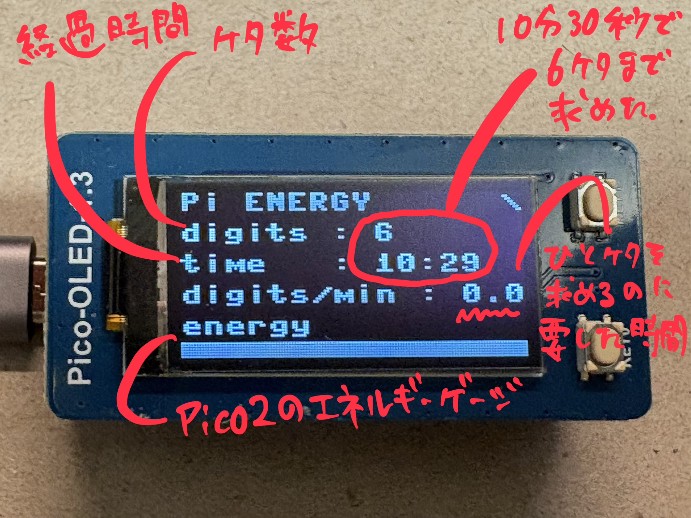
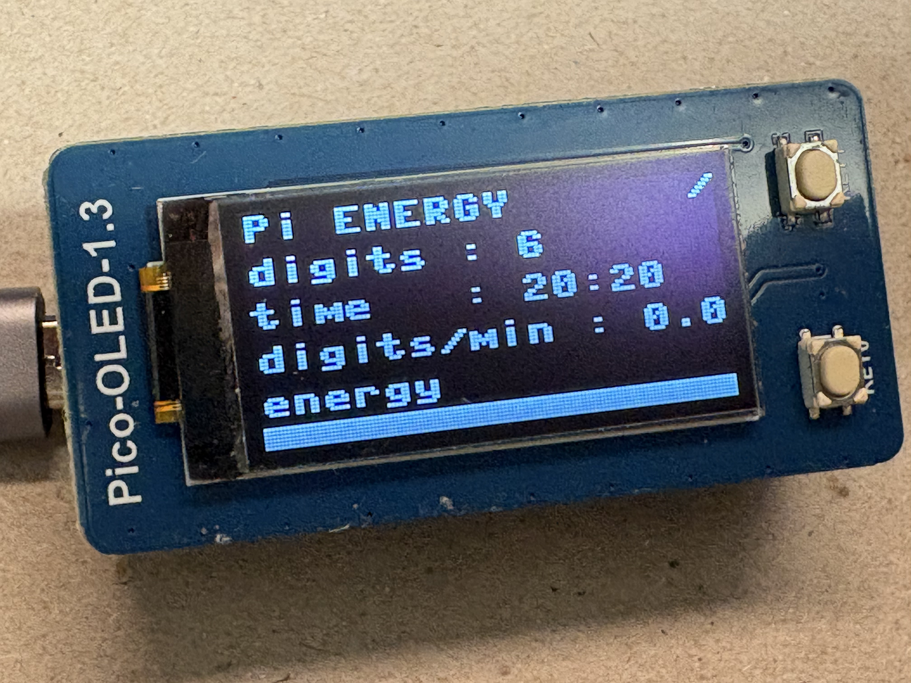

# Pi ENERGY

> このプロジェクトは、生成AI の助けを借りて開発されました。

[English Version](README.md)

**Pi ENERGY** は、Raspberry Pi Pico 2 を用いて、  
**円周率（π）を計算するために必要な「時間」と「計算エネルギー」を可視化する**  
実験的なプロジェクトです。

このプロジェクトは、意図的に **2つのファイルだけ** で構成されています。

- `main.py` — 実行ファイル（表示制御・計算処理をすべて含む）
- `README.md` — 本ドキュメント

外部ライブラリや追加ドライバは使用していません。

---

## コンセプト

円周率について語られるとき、多くの場合は

> 「何桁まで計算されたか」

という *結果* だけが注目されます。

しかし実際には、

- どれだけの **時間** が必要だったのか
- どれだけの **計算量** を積み上げたのか
- 次の1桁のために、どれほどの **労力** が必要なのか

といった *過程* のほうが、本質的です。

**Pi ENERGY** は、こうした「見えないコスト」を表示する装置です。

本プロジェクトの Display は、  
**πの数値そのものは一切表示しません。**

代わりに、  
「次の1桁が、どれほど重いのか」を示します。

---

## 動作環境

- Raspberry Pi Pico 2  
- Waveshare Pico-OLED-1.3（128×64 / SH1107 / SPI）  
- MicroPython  

OLED（SH1107）の制御コードは `main.py` 内に直接記述されています。  
外部のドライバファイル（`*.py`）は不要です。

---

## ディスプレイ出力





---

## 使用しているアルゴリズム

円周率の計算には **Nilakantha（ニラカンタ）級数** を使用しています。

```
π = 3 + 4/(2·3·4) − 4/(4·5·6) + 4/(6·7·8) − ...
```

このアルゴリズムを選んだ理由は次の通りです。

- 数式が単純で分かりやすい
- 収束が遅い
- 桁が増えるほど、必要な計算量が急激に増える

これは「計算効率」を競うには不向きですが、  
**計算に必要なエネルギーを体感する** という本プロジェクトの目的には、
非常によく合っています。

なお、浮動小数点演算（`float`）を使用しているため、
実用的に信頼できる桁数は **6〜7桁程度** で頭打ちになります。

これは制限ではなく、**この装置が伝えたいメッセージの一部**です。

---

## Display レイアウト

OLED は **横向き（128×64）** で使用します。

```
Pi ENERGY
digits : 6
time   : 06:12
digits/min : 0.0
energy
[==========      ]
```

表示している情報は、あえて **4項目だけ** に絞っています。

---

## Display の読み方

### digits（確からしい桁数）

```
digits : 6
```

小数点以下で **どこまで信頼できるか** を示す桁数です。

現在の推定値と真の π との差（誤差）から、

```
誤差 ≈ |π_estimated − π|
digits ≈ floor(−log10(誤差))
```

として概算しています。

「今、何桁までなら信じてよいか？」を表します。

---

### time（経過時間）

```
time : 06:12
```

プログラム起動からの経過時間です。

> 「この桁数に到達するまで、どれだけ時間がかかったか」

を示すための指標です。

---

### digits/min（桁／分）

```
digits/min : 0.0
```

直近60秒間で、  
**1分あたりどれくらい桁が増えているか** を表します。

- 0より大きい値：まだ桁が増えている状態
- `0.0`：最近は新しい桁に到達していない状態

`0.0` が続くのは異常ではありません。  
それは「次の1桁の壁」にぶつかっていることを意味します。

---

### energy（計算エネルギー）

```
[==========      ]
```

計算の **勢い** を示す視覚的なゲージです。

- 最近の最大計算速度に対する相対値
- 桁の進捗を示すものではありません
- あえて抽象的にしています

このゲージは「どれだけ頑張って計算しているか」を
**感覚的に伝えるためのもの**です。

---

## 表示がしばらく変わらない理由

次のような状態は、すべて **正常** です。

- `digits` が長時間変わらない
- `digits/min` が 0.0 のまま
- energy ゲージだけが動き続ける

これは、

> 大量の計算を続けているが、  
> まだ次の1桁には届いていない

という状態を正しく示しています。

円周率計算では、  
**1桁増えるごとに必要なエネルギーは桁違いに増大します。**

---

## このプロジェクトが「やらないこと」

- 高速な円周率計算
- 桁数の記録更新
- ベンチマークや性能比較

これらは目的ではありません。

---

## ファイル構成

```
/
├── main.py
├── README.md
└── LICENSE
```

これがプロジェクトのすべてです。

---

## おわりに

もし Raspberry Pi Pico 2 が、  
1桁増やすのに何分もかかるとしたら、

> **何兆桁もの円周率を計算するスーパーコンピュータは、  
> 本当にすごい存在だと言えるでしょう。**

---

## ライセンス

このプロジェクトは MIT ライセンスの下でライセンスされています。詳細は [LICENSE](LICENSE) ファイルをご覧ください。

